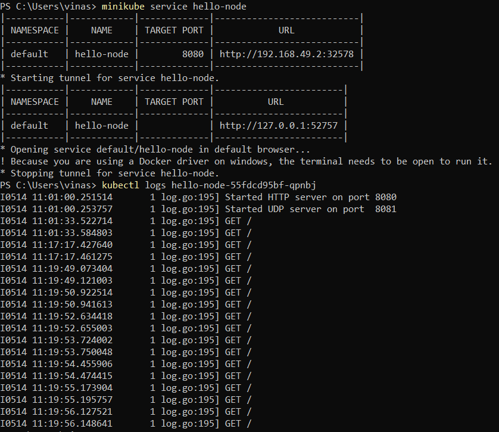

# Tutorial 11 (Minikube)
Nama: Vina Myrnauli Abigail Siallagan 
NPM: 2206825776 
Kelas: Pemrograman Lanjut - A 

---
## REFLEKSI 1
###### 1.1. Compare the application logs before and after you exposed it as a Service. Try to open the app several times while the proxy into the Service is running. What do you see in the logs? Does the number of logs increase each time you open the app?
 
* Benar bahwa terdapat perbedaan karena setelah *service* diekspos, *service* dapat menerima permintaan. 
* Hal ini dapat menyebabkan *log* mencatat setiap permintaan yang diterima. 
* Contohnya, jika *service* hello-node di-refresh berulang kali, log akan mencatat semua permintaan tersebut seperti gambar di atas.
 

###### 1.2. Notice that there are two versions of `kubectl get` invocation during this tutorial section. The first does not have any option, while the latter has `-n` option with value set to `kube-system`. What is the purpose of the `-n` option and why did the output not list the pods/services that you explicitly created?
* Perbedaan antara kedua sintaks tersebut adalah penggunaan opsi `-n`, yang menyatakan bahwa layanan yang dimaksud berada di *namespace* tertentu. 
* Hal ini diperlukan jika ada banyak layanan dengan nama yang sama yang tersebar di berbagai *namespace*. 
* Dengan menggunakan -n, kita memfokuskan perintah get hanya pada *namespace* yang ditentukan setelah opsi `-n`.
 