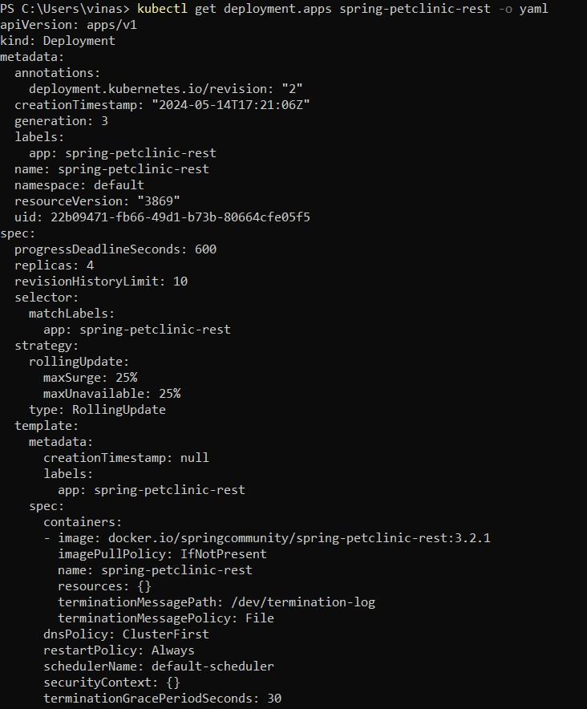

# Tutorial 11 (MiniKube)
Nama: Vina Myrnauli Abigail Siallagan 
NPM: 2206825776 
Kelas: Pemrograman Lanjut - A 

---
## REFLEKSI 1
###### 1.1. Compare the application logs before and after you exposed it as a Service. Try to open the app several times while the proxy into the Service is running. What do you see in the logs? Does the number of logs increase each time you open the app?
 
* Benar bahwa terdapat perbedaan karena setelah *service* diekspos, *service* dapat menerima permintaan. 
* Hal ini dapat menyebabkan *log* mencatat setiap permintaan yang diterima. 
* Contohnya, jika *service* hello-node di-refresh berulang kali, log akan mencatat semua permintaan tersebut seperti gambar di atas.
 

###### 1.2. Notice that there are two versions of `kubectl get` invocation during this tutorial section. The first does not have any option, while the latter has `-n` option with value set to `kube-system`. What is the purpose of the `-n` option and why did the output not list the pods/services that you explicitly created?
* Perbedaan antara kedua sintaks tersebut adalah penggunaan opsi `-n`, yang menyatakan bahwa layanan yang dimaksud berada di *namespace* tertentu. 
* Hal ini diperlukan jika ada banyak layanan dengan nama yang sama yang tersebar di berbagai *namespace*. 
* Dengan menggunakan -n, kita memfokuskan perintah get hanya pada *namespace* yang ditentukan setelah opsi `-n`.
 

## REFLEKSI 2 (Rolling Update & Kubernetes Manifest File)
###### 2.1. What is the difference between Rolling Update and Recreate deployment strategy?
* Strategi Recreate Deployment: 
    - Mengakibatkan *downtime* selama proses pembaruan aplikasi.
    - Proses melibatkan menghapus aplikasi yang lama terlebih dahulu.
    - Aplikasi yang baru kemudian di-deploy setelah aplikasi yang lama dihapus.
    - *Downtime* terjadi antara penghapusan aplikasi lama dan penyelesaian deployment aplikasi baru.
* Strategi Rolling Update:
    - Tidak menyebabkan *downtime* selama pembaruan aplikasi.
    - Aplikasi diperbarui secara bertahap ke versi terbaru.
    - Pembaruan dilakukan secara perlahan, satu per satu, hingga semua *instance* aplikasi menggunakan versi yang baru.
 

###### 2.2. Try deploying the Spring Petclinic REST using Recreate deployment strategy and document your attempt.
* Dibuatnya ulang `springboot-petclinic-rest` yang sudah di *scale* versi 3.0.2
 
* Lalu, sifat dari ReplicaSet akan dimanfaatkan untuk menggantikan pod yang terhapus dengan template-nya. Template tersebut kemudian akan diperbarui ke versi yang baru sesuai dengan pengaturan berikutnya.
 
* Kemudian, periksalah keberhasilan perubahan query yang menghasilkan output seperti di gambar.
 

* Setelah itu, kita delete pod.

* Dapat dilihat bahwa pod-pod yang baru sedang dibuat untuk menggantikan yang lama.

* Kemudian, run dan muncul seperti gambar di bawah ini.

* Terakhir, berhasil. 

 

###### 2.3. Prepare different manifest files for executing Recreate deployment strategy
* Kita dapat membuat file dengan nama deployment2.yaml. Isi file ini akan sama dengan file hasil ekspor dari tutorial, namun dengan beberapa perbedaan di bagian tertentu seperti gambar di bawah.

* File tersebut dapat diimpor ke Kubernetes seperti manifest file biasa. Untuk membuktikan kegunaannya, kita dapat mengganti image di file tersebut ke versi yang diinginkan. Ini akan menghapus pods di ReplicaSet lama dan mendeploy pods baru di ReplicaSet baru, seperti yang terlihat pada gambar di bawah ini.

* Terbuktilah update yang dilakukan secara recreate strategy dan bukan rolling.
 

###### 2.4. What do you think are the benefits of using Kubernetes manifest files? Recall your experience in deploying the app manually and compare it to your experience when deploying the same app by applying the manifest files (i.e., invoking `kubectl apply -f` command) to the cluster.
* Tidak perlu lagi mengingat prosedur dan sintaks untuk melakukan *update* atau *deploymen*t pertama kali.
Seperti mengimpor file pada dokumen, kita tidak perlu tahu bagaimana dokumen tersebut dibuat, yang penting adalah kita memiliki dokumen yang siap digunakan.
* Hal ini berarti kita mengurangi kemungkinan terjadinya *human error*.
* Dengan menggunakan manifest file, layanan yang dibuat sudah sesuai dengan isi file tersebut dan terhindari dari kesalahan yang mungkin terjadi saat mengetikkan sintaks satu per satu.
 